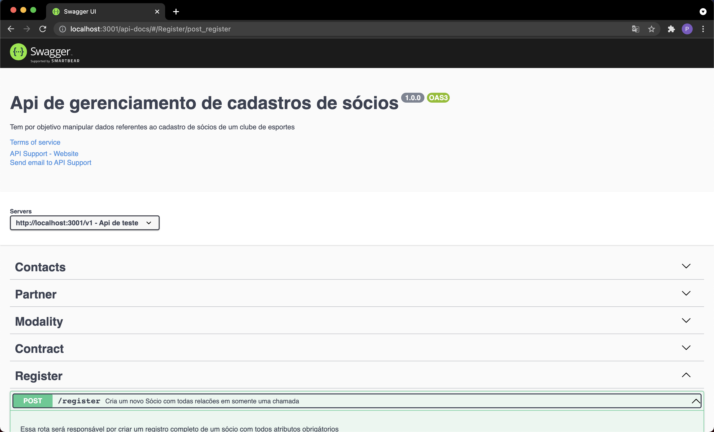
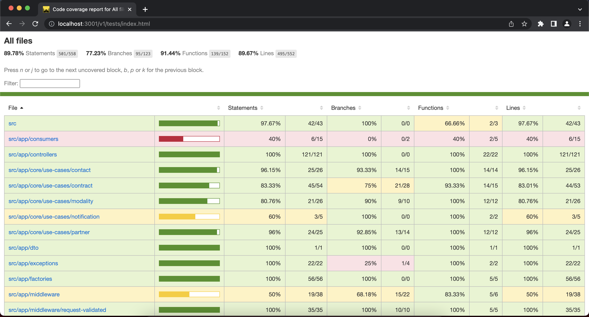
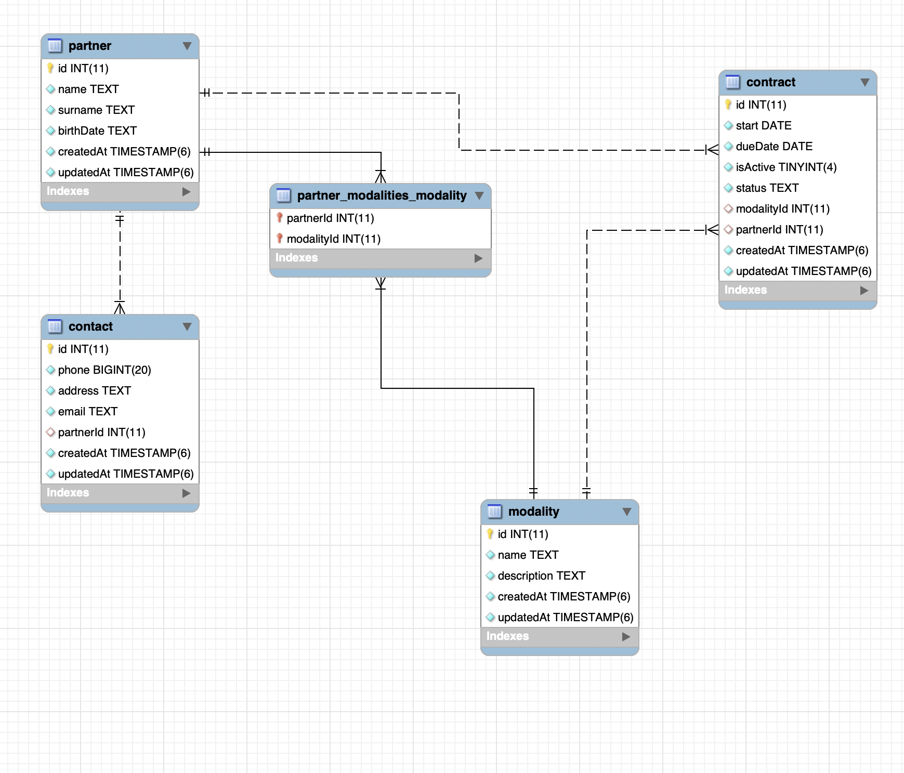

  <a href="#-tecnologias">Tecnologias</a>&nbsp;&nbsp;&nbsp;|&nbsp;&nbsp;&nbsp;
  <a href="#-projeto">Projeto</a>&nbsp;&nbsp;&nbsp;|&nbsp;&nbsp;&nbsp;
  <a href="#-como-executar">Como executar</a>&nbsp;&nbsp;&nbsp;
  <a href="#-requisitos-funcionais">Requisitos funcionais</a>&nbsp;&nbsp;&nbsp;
  <a href="#-modelo-de-dados">Modelo de dados</a>&nbsp;&nbsp;&nbsp;

 

  

## ✨ Tecnologias

Esse projeto foi desenvolvido com as seguintes tecnologias:

- [Docker](https://www.docker.com/)
- [MySql](https://www.mysql.com/)
- [Node.js](https://nodejs.org/en/)

## 📝 Projeto

partners é um micro serviço de cadastros de sócios de um clube de esportes.
## 💻  Como executar em ambiente Development

- Clone o repositório.
- altere a variavel de ambiente `NODE_ENV` para development
- instale as dependencias com `yarn` ou `npm install`
- Na raiz do projeto em um terminal digite `docker-compose up -d` e aguarde até que os dois containers subam.

Agora você pode acessar [`http://localhost:3001/v1/api-docs/`](http://localhost:3001/v1/api-docs/) do seu navegador.

- Para parar a aplicação digite `docker-compose down` na raiz do projeto.
- Para inciar a aplicação novamente digite `docker-compose up` na raiz do projeto.

## 💻  Como executar em ambiente Production

- após clonar e instalar as dependencias do projeto.
- altere a variavel de ambiente `NODE_ENV` para production.
- faça o build da imagem digitando na raiz do projeto `docker build -t pablords/partners --no-cache .`
- depois da imagem criada digite `docker run -d --name partners -p 3001:3001 -e DB_HOST=${IP_SERVIDOR_DB} -e APP_HOST=http://${IP_SERVIDOR} pablords/partners`

Agora você pode acessar [`http://${IP_SERVIDOR}:3001/v1/api-docs/`](http://${IP_SERVIDOR}:3001/v1/api-docs/) do seu navegador.

## ⚙️ Executando Tests unitários

- digite `yarn test:coverage` ou `npm run test:coverage` para rodar todos os testes com coverage

  

## 🔖  Requisitos funcionais

- Cadastro de sócios.
- Cadastro de modalidades esportivas.
- Cadastro de contatos de sócio.
- Cadastro de contratos

## 📉  Modelo de dados

- Pensando na Lgpd os dados de contatos foram separado em uma tabela para casos futuros de extração de dados para analise.

  

